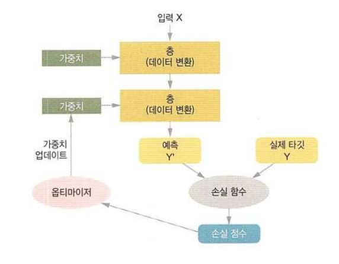
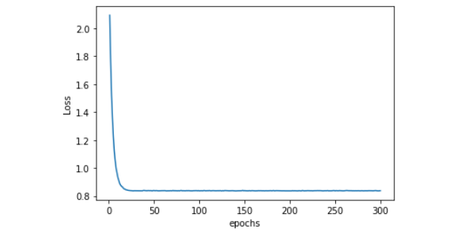
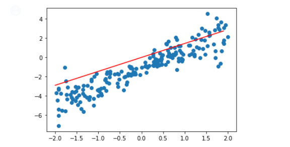
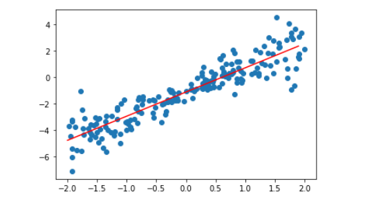
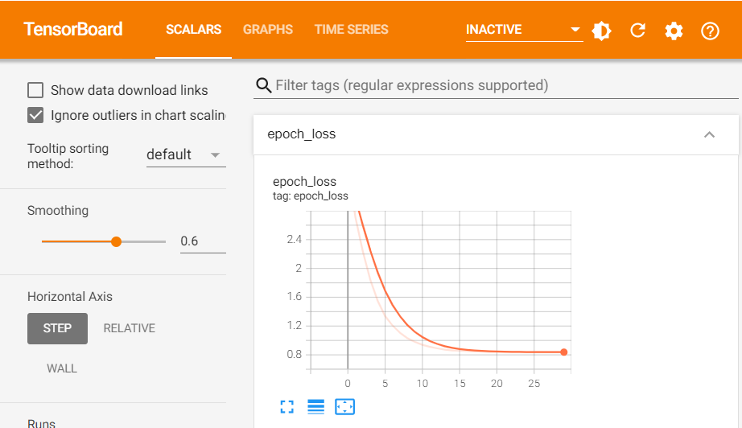
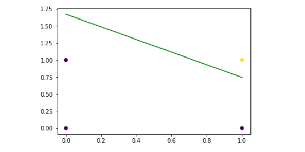
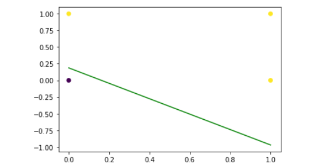
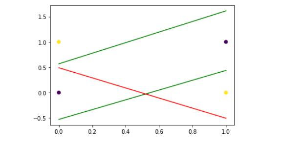
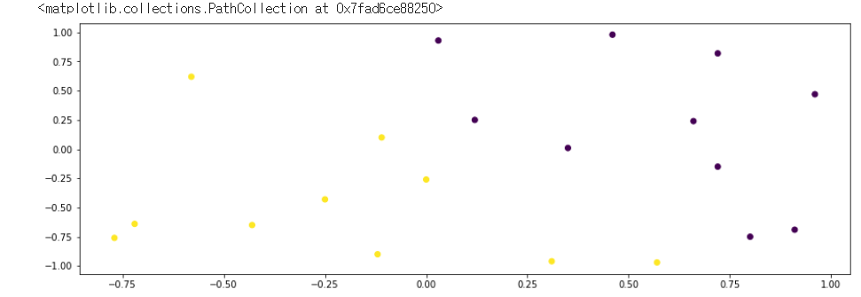

# 220329 🍕


## Tensorflow


### 1. 신경망의 구조

- 신경망 훈련에 관련된 요소들
  - Layer(층): 네트워크를 구성
  - Data(입력 데이터) & Label(타겟 데이터)
  - **손실함수** **(Loss functino)**: 학습에 사용할 피드백 신호를 정의
    - MSE(Regression문제)
    - CTC(시퀀스 학습)
    - Binary cross-entropy(2개의 class 분류)
    - Categorical corss-entropy(n개의 class분류)
  - **옵티마이저(Optimizer)**: 학습 진행방식을 결정 -> 손실함수를 줄이는 과정
    - GD(Full Batch Gradient Descent): 경사 하강법, Batch size = 전체
    - SGD(Stochastic Grdient Descent): Batch size = 1 -> 한개의 학습 데이터씩 가중치 업데이트
    - Mini Batch Gradient Descent: Batch size = 2^n개
      - SGD의 노이즈를 줄이면서도 전체 배치보다는 더 빠르게 최적점을 구함



- Layer란?
  - 하나 이상의 텐서(tensor, 2차원 이상의 행렬)를 입력으로 하나 이상의 텐서를 출력하는 데이터 처리 모듈
  - 대부분 가중치라는 상태를 가짐
    - 가중치: 확률적 경사 하강법에 의해 학습되는 하나 이상의 텐서
    - 네트워크가 학습한 정보가 담겨 있음
  - 종류
    - **완전 연결층 (Fully Connected)/밀집층 (Dense)**: 입력과 출력이 모두 연결된 layer
      - dense 레이어로만 구성되어 있는 것은 Neural Network라고 부름
      - 어떤 모델이든 마지막 노드에서 주로 Dense를 사용 
      - 1차원 데이터만 받을 수 있음
    - **합성곱층 (Convolution)**: 입력 -> filter(kernel) -> 출력 (feature map)
      - CNN: filter만 조정하면 되기 때문에 파라미터 계수가 줄어듦
      - 2차원 데이터를 받을 수 있음: 이미지 데이터 
    - **순환층 (Recurrent)**: 입력 -> hidden state -> 출력
      - RNN: 파라미터는 늘어나지만, 연산 상에서 순서에 대한 개념을 도입
      - 시계열 데이터 
      - 1차원 데이터를 받음

- **Sequential vs Functional** 
  - 모델 구현 방법
  - Sequential: layer을 쌓을 때 일자로 통으로 쌓음
  - Functional: layer들을 만들어 놓고, 연결하는 개념 
  - [functional API](https://wikidocs.net/38861)


### 2. Tensorflow 설치

- local 에설치 : GPU 드라이버 설치 -> CUDA -> CuDNN -> tensorflow gpu 설치 (중요!! version)
  - https://www.tensorflow.org/install/source_windows#tested_build_configurations
- NvidiaDocker + https://hub.docker.com/r/tensorflow/tensorflow/

- 클라우드 이용: Colab, GCP, AWS 

```python
import tensorflow as tf

tf.__version__ # tensorflow version 확인

tf.test.is_gpu_available() #GPU 사용가능 여부 체크 # True

# 난수 생성
import numpy as np
import matplotlib.pyplot as plt

np.random.seed(0) # seed값 고정

def make_random_data():
    x = np.random.uniform(low=-2, high=2, size=200) # -2~2까지 중 200개 뽑기
    y = []
    for t in x:
        r = np.random.normal(loc=0.0, scale=(0.5 + t*t/3), size=None)
        y.append(r) # 정규분포의 노이즈 생성
    return  x, 2*x -1 + np.array(y) # 노이즈 추가

# 모델 생성
# keras 에서 model 을 생성하는 방법
# 공통: model 객체 생성 -> model compile -> model fit
# 방법1. Sequential 
# 방법2. Functional

#sequential 방법으로 model 생성
model = tf.keras.Sequential() # Sequential model 객체 생성후 layer 추가 
model.add(tf.keras.layers.Dense(units=1, input_dim=1)) 
#첫번째 layer의 input_dim : x.shape 의 마지막 차원값 (x.shape 의 첫번째 차원은 데이터의 갯수 )
#마지막 layer의 units : y.shape 의 마지막 차원값 (실제로 예측할 y_data 의 차원을 의미함)

model.summary() #생성된 model 확인 

# 모델 학습
model.compile(optimizer="sgd", loss="mse") 
# hyperparameter 를 지정해준다. 
# hp는 list로 생성후 for문을 이용해 학습시킬수 있다. 

history = model.fit(x, y, epochs= 300)
# model 생성후 data에 맞게 weight를 fitting 하는 과정
# fitting 결과는 history에 저장후 측정값(loss) 등을 불러올수 있다. 

# history 그래프 그리기 : epochs에 따른 loss의 변화를 볼 수 있다. 
epochs = np.arange(1, 300+1)
plt.plot(epochs, history.history["loss"])
plt.xlabel("epochs")
plt.ylabel("Loss")
plt.show()
```



```python
# 학습 전의 data
x_arr = np.arange(-2,2, 0.1)
y_arr = model.predict(x_arr)
plt.plot(x, y, "o")
plt.plot(x_arr, y_arr, "-r")
plt.show()
```



```python
# model 이 data에 fitting 된 상태 
x_arr = np.arange(-2,2, 0.1)
y_arr = model.predict(x_arr)
plt.plot(x, y, "o")
plt.plot(x_arr, y_arr, "-r")
plt.show()
```



```python
# 함수형 API
# input, output , layer 를 따로 생성해 줘야 한다. 
# 이후 tf.keras.Model() 이라는 class를 통해서 model 객체를 생성해준다. 
input = tf.keras.Input(shape=(1,))
output = tf.keras.layers.Dense(1)(input) 
#앞부분의 layer를 뒷부분의 layer에 인자값으로 입력한다. 
#확장성 있는 model을 생성할 수 있다. 

model_fun_api = tf.keras.Model(input, output)
model_fun_api.summary()

model_fun_api.compile(optimizer="sgd", loss="mse")

history_fun_api = model_fun_api.fit(x, y, epochs= 300)

# 모델을 학습시킨후 model을 load하는 방법 -> 가중치만 추가하여 별도의 학습과정 없이 사용 
model_fun_api.save("weights_sample.h5")

input = tf.keras.Input(shape=(1,))
output = tf.keras.layers.Dense(1)(input)

model_fun_api2 = tf.keras.Model(input, output)
model_fun_api2.summary()

model_fun_api2.load_weights("weights_sample.h5") # 가중치 불러오기

model_fun_api2.compile(optimizer="sgd", loss="mse")

# 전이학습 : 이미 학습된 model에서 dataset을 추가해 추가 학습을 진행시킨다. model은 tensor hub에 있다. 
```


### 3. Tensorboard

`<model_name>.callbacks.TensorBoard` 를 통해 학습데이터를 저장한후 tensorboard를 이용해 시각화 할수 있다. 

```python
# model 생성
callback_list = [tf.keras.callbacks.TensorBoard(log_dir="logs")]
model2.compile(optimizer="sgd", loss="mse")
history = model2.fit(x, y, epochs=30, callbacks=callback_list)

# model 시각화
logdir = "./logs"
tensorboard_callback = tf.keras.callbacks.TensorBoard(logdir)
%load_ext tensorboard
%tensorboard --logdir=./logs
```



그 외 자주 사용하는툴

- 상용 : https://wandb.ai/site : 시각화툴

- opensource : katib : https://www.kubeflow.org/docs/components/katib/overview/

- tensorboard what if tool : https://www.tensorflow.org/tensorboard/what_if_tool


## Dense Layer

### 1. 이진분류 (AND, OR, XOR) 학습

#### 1) AND

````python
import numpy as np
import tensorflow as tf

# AND
x_data = [[0,0],
          [0,1],
          [1,0],
          [1,1]]
y_data = [[0],
          [0],
          [0],
          [1]]

# 연산을 위해 list를 array형태로 변환
# list 의 용도 : 객체 저장소( 파이썬은 모든게 다 객체다. -> 모든걸 다 리스트에 넣을수 있다. )
# array : 숫자 저장소, 숫자의 연산이 가능 (차원에 따라서 스칼라, 벡터, 행렬, 텐서 )
x_data = np.array(x_data) 
y_data = np.array(y_data)

# 데이터 확인
x_data.shape # (4, 2) -> 레코드가 4개, 2차원 (하나의 레코드가 값이 2개씩 구성되어 있으므로)

# 1. sequential 객체 생성
model_and = tf.keras.Sequential() 

# 2. Dense layer 추가
model_and.add(tf.keras.layers.Dense(1, activation="sigmoid", input_shape=(2,)))
# 노드 갯수 = 1, 활성화 함수 = sigmoid, 받는 차원 = (2,)


# 3. compile 
model_and.compile(optimizer="sgd", loss="binary_crossentropy", metrics=["accuracy"])
# optimizer: 최적화 방법(디폴트는 adam), 
# loss: 손실함수(이진분류 crossentropy) -> 출력이 0또는 1
# mereics: 성능 기준의 간접적인 평가 지표. 하지만, 학습데이터와 실제 성능의 accuracy가 달라지는 일도 빈번함.

# 4. model fit 
model_and.fit(x_data, y_data, epochs=3000, batch_size=4) 
# epochs: 전체 데이터셋을 3000번 보겠다
# batch: 전체 데이터를 한번에 4개씩 보겠다. 가중치가 업데이트되는 기준

# 5. predict
# 원래는 test데이터로 넣어서 진행. 여기서는 그냥 학습데이터로 한 것임
model_and.predict(x_data) # array([[0.08041815],
                                # [0.2734547 ],
                                # [0.25232592],
                                # [0.5922486 ]], dtype=float32)

# 가장 큰 값을 찾기
np.round(model_and.predict(x_data)) # array([[0.],
                                           # [0.],
                                           # [0.],
                                           # [1.]], dtype=float32)	

````

```python
# 학습된 가중치로 그래프 그려보기
import matplotlib.pyplot as plt

# 가중치 받아오기
weights = model_and.layers[0].get_weights()[0]
biases = model_and.layers[0].get_weights()[1]

# 그래프 그리기
plt.scatter(x_data[:,0], x_data[:,1], c=y_data)
x = np.linspace(np.amin(x_data[:,:1]),np.amax(x_data[:,:1]))

a = -weights[0]/weights[1]
b = -biases[0]/weights[1] 


plt.rcParams["figure.figsize"] = (15,5)
plt.plot(x, [a*i + b for i in x], color='green') # 선분을 기준으로 값의 영역을 나눌 수 있음

plt.show()
```



```python
# running_rate 조절하는 법 (디폴트는 0.01)
sgd = tf.keras.optimizers.SGD(learning_rate = 0.001) 
model.compile(optimizer = sgd, loss = "binary_crossentropy", metrics = ["accuracy"])
```


#### 2) OR

```PYTHON
import numpy as np
import tensorflow as tf
import matplotlib.pyplot as plt

x_data = [[0,0],
          [0,1],
          [1,0],
          [1,1]]
y_data = [[0],
          [1],
          [1],
          [1]]

x_data = np.array(x_data)
y_data = np.array(y_data)

# 모델 생성
model_or = tf.keras.Sequential()
model_or.add(tf.keras.layers.Dense(1, activation="sigmoid", input_shape=(2,)))
model_or.compile(optimizer="sgd", loss="binary_crossentropy", metrics=["accuracy"])

# 모델 학습
model_or.fit(x_data, y_data, epochs=3000,batch_size=4)

# 예측
np.round(model_or.predict(x_data)) # array([[0.],
                                          # [1.],
                                          # [1.],
                                          # [1.]], dtype=float32)

# 가중치 가져오기
model_or.layers[0].get_weights() # [array([[2.3614073],
                                 # [2.0397925]], dtype=float32), array([-0.38158], dtype=float32)]

# 가중치 그래프 그리기
weights = model_or.layers[0].get_weights()[0] 
biases = model_or.layers[0].get_weights()[1]
plt.scatter(x_data[:,0], x_data[:,1], c=y_data)
x = np.linspace(np.amin(x_data[:,:1]),np.amax(x_data[:,:1]))

a = -weights[0]/weights[1]
b = -biases[0]/weights[1] 


plt.rcParams["figure.figsize"] = (15,5)
plt.plot(x, [a*i + b for i in x], color='green')

plt.show()
```




#### 3) XOR

- XOR은 노드 1개 만으로는 선형 그래프를 그릴 수 없음. 따라서 노드 2개를 사용 -> Layer 2개

```PYTHON
import numpy as np
import tensorflow as tf
import matplotlib.pyplot as plt

x_data = [[0,0],
          [0,1],
          [1,0],
          [1,1]]
y_data = [[0],
          [1],
          [1],
          [0]]

x_data = np.array(x_data)
y_data = np.array(y_data)

x_data.shape # (4,2)
y_data.shape # (4,1)

# 모델 생성
model_xor = tf.keras.Sequential()

# 노드 2개 생성
model_xor.add(tf.keras.layers.Dense(2, activation = "sigmoid" ,input_shape = (2,)))
model_xor.add(tf.keras.layers.Dense(1, activation = "sigmoid"))

model_xor.compile(optimizer = tf.keras.optimizers.SGD(learning_rate=0.1), loss="binary_crossentropy", metrics=["accuracy"])

# 학습
model_xor.fit(x_data, y_data, batch_size=4, epochs=2000)

# 예측
np.round(model_xor.predict(x_data)) # array([[0.],
                                           # [1.],
                                           # [1.],
                                           # [0.]], dtype=float32)

# 가중치 가져오기: 노드가 2개이므로 가중치도 2개씩
weights_0 = model_xor.layers[0].get_weights()[0]
biases_0 = model_xor.layers[0].get_weights()[1]

weights_1 = model_xor.layers[1].get_weights()[0]
biases_1 = model_xor.layers[1].get_weights()[1]

# 가중치로 그래프 그리기
plt.scatter(x_data[:,0], x_data[:,1], c=y_data)
x = np.linspace(np.amin(x_data[:,:1]), np.amax(x_data[:,:1]))

a_0 = -weights_0[0]/weights_0[1]
b_0 = -biases_0[0]/weights_0[1] 

a_1 = -weights_1[0]/weights_1[1]
b_1 = -biases_1[0]/weights_1[1] 


plt.rcParams["figure.figsize"] = (15,5)
plt.plot(x, [a_0*i + b_0 for i in x], color='green')
plt.plot(x, [a_1*i + b_1 for i in x], color='red')


plt.show()
```




### 2. 이진분류 실습

- data를 x_data와 y_data로 분류하기

```python
# data 탐색
import numpy as np

data = [
    [0.72,0.82,-1],
    [0.91,-0.69,-1],
    [0.03,0.93,-1],
    [0.12,0.25,-1],
    [0.96,0.47,-1],
    [0.8,-0.75,-1],
    [0.46,0.98,-1],
    [0.66,0.24,-1],
    [0.72,-0.15,-1],
    [0.35,0.01,-1],
    [-0.11,0.1,1],
    [0.31,-0.96,1],
    [0.0,-0.26,1],
    [-0.43,-0.65,1],
    [0.57,-0.97,1],
    [-0.72,-0.64,1],
    [-0.25,-0.43,1],
    [-0.12,-0.9,1],
    [-0.58,0.62,1],
    [-0.77,-0.76,1]
]

data = np.array(data) # list to numpy
data.shape  # (20, 3)

x_data = data[:, 0:2]
y_data = data[:, 2:]

x_data.shape # input_shape을 결정하기 위해 x_data의 차원 확인 # (20, 2)
y_data.shape # out_layer 의 units 갯수를 결정하기 위해 y_data 의 차원 확인 
```

- **Data scaling**
  - -1 ~ +1 까지의 데이터를 0~1 까지의 값으로 변경해준다. 
  - activation function 또는 loss function 의 계산 결과가 안정적으로 나오기 위해 
  - 학습도 더 잘된다. ANN 뿐만 아니라. RNN, CNN 등에도S 사용한다. 
  - 방법1. 수식으로 변경해준다. y_data = (y_data+1)/2
  - 방법2. module 을 사용한다. (sklearn)

```python
from sklearn.preprocessing import MinMaxScaler

scaler = MinMaxScaler() #객체 생성
scaler.fit(y_data) #data에 맞게 객체 변경
y_data = scaler.transform(y_data) # 변경된 객체를 통해 data 변경

y_data # array([[0.],
              # [0.],
              # [0.],
scaler.inverse_transform(y_data) # array([[-1.],
       									# [-1.],
       									# [-1.],
```

- 그래프를 그리고, 이 점들을 나누는 모델 생성 (직선 긋기)

```python
# data 그래프
import matplotlib.pyplot as plt
plt.scatter(x_data[:,0],x_data[:,1], c=y_data)

import tensorflow as tf

model = tf.keras.Sequential()
model.add(tf.keras.layers.Dense(1, activation="sigmoid", input_shape=(2,)))

model.compile(optimizer="sgd", loss = "binary_crossentropy", metrics = ["accuracy"])

history = model.fit(x_data, y_data, batch_size=20, epochs = 1500)

# 직선을 추가한 그래프
weights = model.layers[0].get_weights()[0]
biases = model.layers[0].get_weights()[1]
plt.scatter(x_data[:,0], x_data[:,1], c=y_data)
x = np.linspace(np.amin(x_data[:,:1]),np.amax(x_data[:,:1]))

a = -weights[0]/weights[1]
b = -biases[0]/weights[1] 


plt.rcParams["figure.figsize"] = (15,5)
plt.plot(x, [a*i + b for i in x], color='green')

plt.show()

# 예측
scaler.inverse_transform(np.round(model.predict(x_data))) # array([[0.],
                                                                # [0.],
                                                                # [0.],
scaler.inverse_transform(y_data) # array([[-1.],
                                        # [-1.],
                                        # [-1.],
```




