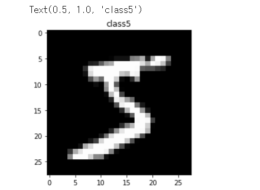
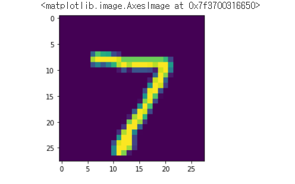
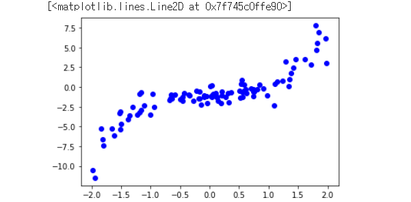
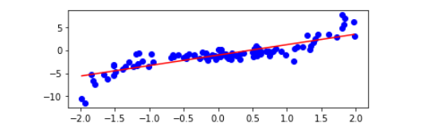
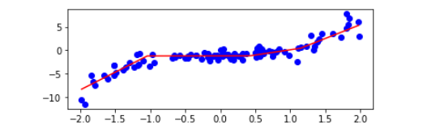

# 220330🍕


## Dense Layer


### 3. MNIST 손글씨 데이터 예측

```PYTHON
import tensorflow as tf
from tensorflow.keras.datasets import mnist
import numpy as np 
import matplotlib.pyplot as plt

# mnist 데이터 불러오기
(x_train, y_train), (x_test, y_test) = mnist.load_data()

# 데이터 형태 보기
x_train.shape # (60000, 28, 28) -> 총 60000장, 한장은 28*28 픽셀로 이루어져 있음
y_train.shape # (60000,) # 60000개의 벡터 (0~9까지의 수들로 구성됨)

# x_train[0]의 그림 보기
plt.imshow(x_train[0], cmap="gray")
plt.title(f"class{y_train[0]}") # y_train[0] = 5 이므로 'class5'라는 제목이 붙여짐
```



```PYTHON
# 데이터 크기 변환: dense 레이어는 1차원만 받을 수 있기 때문에
x_train = x_train.reshape(60000,784)
x_test = x_test.reshape(10000,784)

# 크기 변환 확인
x_train.shape # (60000, 784)
x_train[0] # array([  0,   0,   0,   0,   0,   0,   0,   0,   0,   0,   0,   0,   0, ..., dtype=uint8)

# 정답 데이터를 원-핫 인코딩
y_train = tf.keras.utils.to_categorical(y_train)
y_test = tf.keras.utils.to_categorical(y_test)

# 변환 데이터 형태 확인
y_train[0].shape # (10,) -> 0 ~ 9
y_train[0]  # array([  0,   0,   0,   0,   0,   0,   0,   0,   0,   0] dtype=uint8)
```

```PYTHON
# 모델 생성
model = tf.keras.Sequential()
model.add(tf.keras.layers.Dense(512, activation="relu", input_shape=(784,))) 
model.add(tf.keras.layers.Dense(512, activation="relu"))
model.add(tf.keras.layers.Dense(10, activation="softmax"))

model.compile(optimizer="adam", loss=tf.keras.losses.CategoricalCrossentropy(), metrics=["accuracy"])

# x_test[0]으로 예측해보기
model.predict(x_test[0]) # 에러 발생: train 데이터의 shape은 (60000,784)였기 때문에 1개의 데이터만을 가져올 때의 shape를 인식하지 못함 -> reshape 필요
test_data = x_test[0].reshape(1,784)
test_data.shape # (1, 784)

np.round(model.predict(test_data)) # array([[0., 0., 0., 0., 0., 0., 0., 1., 0., 0.]], dtype=float32) -> 숫자 7이 답

# 예측 결과와 실제 이미지 확인
test_data_img = x_test[0].reshape(28,28) # 이미지를 보기 위해 다시 28*28로 reshape
plt.imshow(test_data_img) # 숫자 7 이미지가 보여진 것을 봤을 때, 예측이 잘 되었음을 확인
```




## 4. 비선형 데이터 예측

예측할 data

```PYTHON
import tensorflow as tf
import numpy as np
import matplotlib.pyplot as plt

def make_random_data():
  x = np.random.uniform(low=-2, high=2, size=100)
  y = []
  for t in x:
      r = np.random.normal(loc=0.0, scale=(0.5 + t*t/3), size=None)
      y.append(r)
  return  x, x**3 + -1 + np.array(y)
# x^3 + -1 인 곡선 (x-1)(x^2+x+1)

x, y =  make_random_data()
plt.plot(x,y, "bo")
```



TanH로 모델 생성

```python
model_regression = tf.keras.Sequential()
model_regression.add(tf.keras.layers.Dense(1, activation="tanh", input_shape=(1,)))
model_regression.add(tf.keras.layers.Dense(1))

model_regression.compile(optimizer="sgd", loss = "mse")
model_regression.fit(x, y, epochs = 100)

x_predict = np.arange(min(x), max(x), 0.01)
y_predict = model_regression.predict(x_predict)

plt.plot(x,y, "bo")
plt.plot(x_predict, y_predict, "red")
```


relu로 모델 생성

```python
# 여러 model을 만들어서 예측
model_list = []
for i in range(1, 10):
  model_regression = tf.keras.Sequential()
  model_regression.add(tf.keras.layers.Dense(i, activation="relu", input_shape=(1,)))
  model_regression.add(tf.keras.layers.Dense(1))

  model_regression.compile(optimizer="sgd", loss="mse")
  model_regression.fit(x,y, epochs=500)

  model_list.append(model_regression)
    
model_list # 10개의 모델이 생성된 것을 볼 수 있음

# layer0 units 갯수에 따른 regerssion 곡선
plt.subplots_adjust(bottom=5, top=10, 
                    wspace=0.2, 
                    hspace=0.35)
for i in range(0, len(model_list)):
  x_predict = np.arange(min(x), max(x), 0.01)
  y_predict = model_list[i].predict(x_predict) #model의 predict 된 결과를 그래프로 표현해 보자. 
  plt.subplot(len(model_list)+1,1, i+1) # 1개의 행, model_list길이 만큼의 subplot
  plt.plot(x,y, "bo")
  plt.plot(x_predict, y_predict, "red")

# 손실함수, model의 units의 결과에 따라 학습된 결과가 달라진다. 
# 거듭할수록 정교해 지지만 overfitting 문제가 발생할 수 잇다. 
```

unit1일 때



unit10일 때




---


#### 데이터를 나누기 위한 단위

- Epoch: 전체 sample 데이터를 이용하여 한 바퀴 돌며 학습하는 것을 1회 epoch이라고 함
- Step: Weight와 Bias를 1회 업데이트 하는 것을 1step이라고 함
- Batch: 1step에서 사용한 데이터의 수
  - ex) batch size = 100, step = 5 -> 약 500개의 데이터를 이용한 것
- Iteratino: 1회 학습을 1iteration이라고 함


#### 도움말 보기

- `help(tf.keras.Sequential)` 코드 입력

- google에 `tf.keras.Sequential` 검색하여 docs 확인 (https://www.tensorflow.org/api_docs/python/tf/keras/Sequential)

  

#### 원-핫 인코딩 설명

https://wikidocs.net/22647
