# 220331🍕


## 합성곱 신경망 (Convolution Neural Network, CNN)


### 1. 도입 배경

- 기계가 이미지를 인식하는 방법?

-> 픽셀 단위로 쪼개서 (28 * 28)

-> flatten하여 인식 (1 * 784)


- 사람은 모양으로 인식함

-> 이처럼 '위상' 변화의 영향을 받지 않고 이미지를 어떻게 학습할 수 있을까?


- 대뇌 시각피질 실험

고양이는 사선형 edge를 detect할 수 있음

-> 기울어진 크고 작은 edge 요소들의 합성 과정을 통해 전체 이미지를 구성함


- 이미지를 어떻게 인식할 수 있을까?

  - **이미지의 윤곽을 찾아내기 ->** **kernel 기법**(x_train의 윤곽을 인식)

  - 어떤 사물인지 어떻게 알 수 있을까 -> 윤곽에 label 붙이기 (y_train으로 정답을 넣기)


### 2. Kernel 기법 

#### 1) Convolution (합성곱)

- kernel 기법: 행렬끼리 convolution 연산하는 것

- Convolution 연산

  - **일정 영역의 값들(window)**에 대해 **가중치(kernel = filter)**를 적용하여 하나의 값을 만드는 연산


  - 두 개의 신호를 **합성**해서 내보내는 연산 (곱한 후 적분)


1. window와 kernel을 같은 자리(행,열)에 해당하는 수끼리 곱하고(요소곱) 모두 더하기

2. 옆으로 한 칸 이동해서 다시 합성곱
3. 첫번째 자리에서 밑으로 한 칸 이동해서 합성곱
4. 옆으로 한 칸 이동해서 합성곱


#### 2) CNN

- Convolution연산을 이용한 network

- CNN에서 학습을 통해서 나오는 model의 가중치들은 무엇이 학습되는 걸까?

  - kernel값이 학습된다

- kernel값이 학습될 수록 이미지의 특징을 추출하게 된다.

- 추출된 특징을 추상화시켜 이미지를 분류할 수 있다.

  

#### 3) Kernel로 이미지 불러오기

```python
from PIL import Image, ImageFilter
import matplotlib.pyplot as plt

# wget: 웹에서 이미지를 다운로드 받을 수 있는 프로그램
!wget https://i.imgur.com/K85HUBK.jpeg

# 이미지 저장
origin_img = Image.open("./K85HUBK.jpeg")

# 이미지 열기
display(origin_img)

# 커널1 만들기 
edge_1 = [
          1, 0, -1, 
          1, 0, -1, 
          1, 0, -1
]

# image에 filter 씌우기
convol_img = origin_img.filter(ImageFilter.Kernel((3,3), edge_1, 1, 0))

# 이미지 열기
display(convol_img)

# 이미지에 커널2를 씌우고 이미지 열기
edge_2 = [
          0, 1, 0, 
          0, 1, 0, 
          0, 1, 0
]

convol_img2 = origin_img.filter(ImageFilter.Kernel((3,3), edge_2, 1, 0))

display(convol_img2)
```

- kernel의 방향에 따라 빛을 받는 방향이 달라지거나 특성이 달라짐
  - [다양한 종류의 kernel](https://en.wikipedia.org/wiki/Kernel_(image_processing))

- kernel의 갯수에 따라 출력 channel의 개수 결정됨


#### 3) 패딩 (Padding)

padding처리: 합성곱 연산을 수행하기 전에 입력 데이터 주변을 0과 같은 특정 값으로 채우는 것

- **출력 크기를 조정**하기 위해 사용함

- ex) (4 x 4 + padding1) * (3 x 3) = 4 x 4

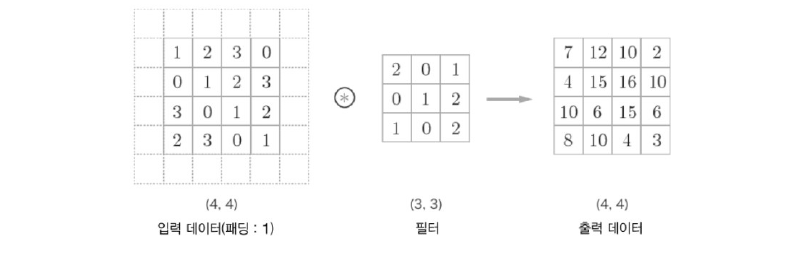


#### 4) 스트라이드 (Stride)

필터를 적용하는 위치의 간격

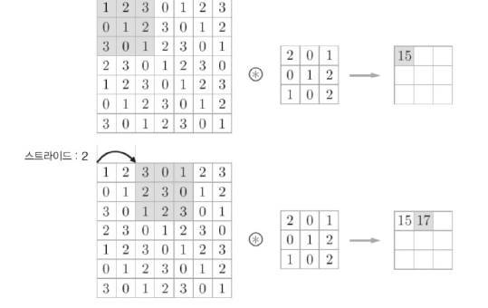


#### 5) Pooling (풀링)

- 입력으로 주어지는 정보를 최대/최소/평균값으로 압축하여 **데이터 연산량을 줄여주는** 역할 수행

- 2차원 데이터의 세로 및 가로 방향의 공간을 줄이는 연산

- conv 연산의 결과를 대푯값을 추출해내는 과정

  - **최대 풀링(max)**: 영역에서 최댓값을 취함 -> 이미지 인식 분야에서 주로 사용

  - **최소 풀링(min)**:  영역의 최솟값

  - **평균 풀링(average)**: 영역의 평균값을 계산


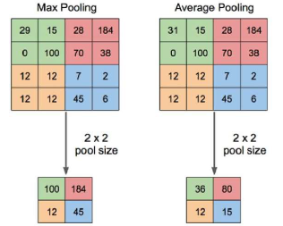

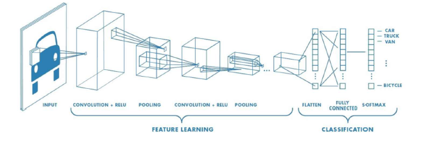


### 2. MNIST 손글씨 데이터 예측

#### 1) 값 예측하기

```PYTHON
import tensorflow as tf 
import numpy as np
import matplotlib.pyplot as plt
from tensorflow.keras.datasets import mnist

# MNIST 데이터셋 불러오기
(x_train,y_train), (x_test, y_test) = mnist.load_data()

# 정답 데이터 원-핫 인코딩
y_train = tf.keras.utils.to_categorical(y_train)
y_train[0] # array([0., 0., 0., 0., 0., 1., 0., 0., 0., 0.], dtype=float32)
# 참고
# loss function 을 SparseCategoricalCrossentropy 을 이용해 학습한다면
# onehot encoding 을 해줄 필요없다. 
# https://www.tensorflow.org/api_docs/python/tf/keras/losses/SparseCategoricalCrossentropy

# 모델 생성
x_train.shape # 데이터 형태 확인 (60000, 28, 28)

model = tf.keras.Sequential()

# convolution layer
model.add(tf.keras.layers.Conv2D(filters=64, kernel_size= (3,3), activation = "relu", input_shape=(28, 28, 1))) # output: 64개 이미지
model.add(tf.keras.layers.MaxPooling2D(pool_size=2)) # 64개 이미지 축소
model.add(tf.keras.layers.Conv2D(filters=128, kernel_size= (3,3), activation = "relu")) # input이 64개, output이 128개 이미지
model.add(tf.keras.layers.MaxPooling2D(pool_size=2)) # 128개 이미지 축소

# dense layer
model.add(tf.keras.layers.Flatten())  # 추출된 특징을 추상화
model.add(tf.keras.layers.Dense(units=128, activation="relu")) #추상화된 값들의 패턴을 학습
model.add(tf.keras.layers.Dense(units=64, activation="relu")) #추상화된 값들의 패턴을 학습
model.add(tf.keras.layers.Dense(units=10, activation="softmax"))  # 분류

# 모델 학습
model.compile(loss="categorical_crossentropy", optimizer= "adam", metrics=["accuracy"])
model.fit(x_train, y_train, batch_size = 1024, epochs=3) 

# 모델 예측
model.predict(x_test[0].reshape((1,28,28))) # array([[2.6022948e-07, 4.9259668e-08, 2.0601020e-04, 
                                            # 5.7503569e-04,3.2923658e-08, 2.9364080e-07, 2.9958514e-07, 
                                            # 9.9848312e-01, 5.7871810e-05, 6.7706214e-04]], dtype=float32)
np.argmax(model.predict(x_test[0].reshape((1,28,28)))) # 최댓값: 7

# 정답 확인
y_test[0] # 7

# confusion matrix로 정답 확인
from sklearn.metrics import confusion_matrix

p_test = model.predict(x_test).argmax(axis=1)
confusion_matrix(y_test, p_test) # true 값과 Predict 값을 비교하여 matrix 로 표현한다. (잘 학습되지 않는 요소를 알수 있다. )

#np.where true false 를 통해 틀린 값의 index를 추출
miss_id = np.where(p_test != y_test)[0] 
i = np.random.choice(miss_id) #하나씩 추출해서 확인
plt.imshow(x_test[i])
plt.title(f"true:{y_test[i]}, predict:{p_test[i]}")
```

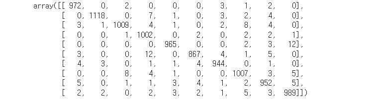

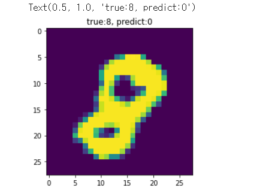

#### 2) 예측 값의 홀수 여부 판단

- inputdata = image 

- output = 짝수, 홀수 판단
- ex) 숫자 7 인 이미지를 input -> [0,0,0,0,0,0,0,1,0,0], [1]

```python
import tensorflow as tf 
import numpy as np
import matplotlib.pyplot as plt
from tensorflow.keras.datasets import mnist
from tensorflow.python.keras.utils.vis_utils import plot_model

# MNIST 데이터셋 불러오기
(x_train,y_train), (x_test, y_test) = mnist.load_data()

# 정답 데이터 원-핫 인코딩
y_train = tf.keras.utils.to_categorical(y_train)
y_train[:5] # array([[0., 0., 0., 0., 0., 1., 0., 0., 0., 0.],..., dtype = float32)

# 정답 데이터를 홀수는 1, 짝수는 0인 array로 만들기
y_train_odd = [] 
for i in y_train:
  if i % 2 == 0 :
    y_train_odd.append(0)
  else:
    y_train_odd.append(1)
y_train_odd = np.array(y_train_odd)

y_train_odd[:5] # array([1, 0, 0, 1, 1])

# 모델 생성 (Functional 방식) # 코드 설명: flatten왜 두번? concatenate는 뭔지?
# 노드 만들기
input = tf.keras.layers.Input(shape=(28,28,1), name="input")

conv_1 = tf.keras.layers.Conv2D(64, (3,3), activation="relu", name="conv_1")(input)
pool_1 = tf.keras.layers.MaxPooling2D((2,2), name="maxpool_1")(conv_1)
conv_2 = tf.keras.layers.Conv2D(128, (3,3), activation="relu", name="conv_2")(pool_1)
pool_2 = tf.keras.layers.MaxPooling2D((2,2), name="maxpool_2")(conv_2)

flatten_1 = tf.keras.layers.Flatten(name="flatten_1")(pool_2)
flatten_2 = tf.keras.layers.Flatten(name="flatten_2")(input)

concat = tf.keras.layers.Concatenate()([flatten_1,flatten_2])

num_out = tf.keras.layers.Dense(10, activation="softmax", name ="num_out")(concat)
odd_out = tf.keras.layers.Dense(1, activation="sigmoid", name="odd_out")(flatten_2)

model = tf.keras.models.Model(inputs=input, outputs=[num_out, odd_out])

# 모델에 사용되는 노드 확인
model.summary()

# compile
# num_out: softmax함수 -> 다중 분류 (0~1)
# odd_out: sigmoid함수 -> 이진 분류 (0,1)
model.compile(optimizer="adam",
              loss={"num_out":"categorical_crossentropy", "odd_out":"binary_crossentropy"},
              metrics=["accuracy"])

# 모델 학습
model.fit({"input": x_train}, {"num_out":y_train, "odd_out":y_train_odd},
          epochs=5)

# 모델 예측
y_num, y_odd = model.predict(x_test[1].reshape(1,28,28))

# 예측값 확인
y_num # array([[0., 0., 1., 0., 0., 0., 0., 0., 0., 0.]], dtype=float32)

# 홀수 여부 예측 확인
np.round(y_odd) # array([[0.]], dtype=float32)

# 정답 확인
plt.imshow(x_test[1])
y_test[1] # 2
```


### 3. Fashion_mnist 데이터셋 학습

Mnist 데이터셋 학습할 때와 model 은 같지만 dataset이 바뀜에 따라 model의 용도가 변경된다. 

```PYTHON
import tensorflow as tf
import numpy as np
import matplotlib.pyplot as plt

fashtion_mnist = tf.keras.datasets.fashion_mnist
(x_train, y_train), (x_test, y_test) = fashtion_mnist.load_data()

plt.imshow(x_train[0])
fashtion_mnist.load_data?

set(y_train) # {0, 1, 2, 3, 4, 5, 6, 7, 8, 9}

# 숫자 mnist와 같은 model 이다. 
model = tf.keras.Sequential()
model.add(tf.keras.layers.Conv2D(filters=64, kernel_size= (3,3), activation = "relu", input_shape=(28, 28,1)))
model.add(tf.keras.layers.MaxPooling2D(pool_size=2))
model.add(tf.keras.layers.Conv2D(filters=128, kernel_size= (3,3), activation = "relu"))
model.add(tf.keras.layers.MaxPooling2D(pool_size=2))
model.add(tf.keras.layers.Flatten())
model.add(tf.keras.layers.Dense(units=128, activation="relu"))
model.add(tf.keras.layers.Dense(units=64, activation="relu"))
model.add(tf.keras.layers.Dense(units=10, activation="softmax"))

model.compile(loss="sparse_categorical_crossentropy", optimizer="adam", metrics=["accuracy"])
model.fit(x_train, y_train, batch_size=1024, epochs=4)

# 예측
np.round(model.predict(x_test[0].reshape(1,28,28))) # array([[0., 0., 0., 0., 0., 0., 0., 0., 0., 1.]], dtype=float32)
y_test[0] # 정답값 확인: 9

# confusion matrix
from sklearn.metrics import confusion_matrix
p_test = model.predict(x_test).argmax(axis=1)
confusion_matrix(y_test, p_test)

miss_id = np.where(p_test != y_test)[0]
i = np.random.choice(miss_id)
plt.imshow(x_test[i])
plt.title(f"true:{y_test[i]}, predict:{p_test[i]}")

model.predict(x_test[i].reshape(1,28,28)) # array([[1.5479356e-01, 3.8992381e-04, 4.1643709e-01, 7.5892109e-04, 7.8588547e-03, 3.4834441e-06, 3.5630846e-01, 2.5665244e-05, 5.9715178e-02, 3.7088657e-03]], dtype=float32)
```

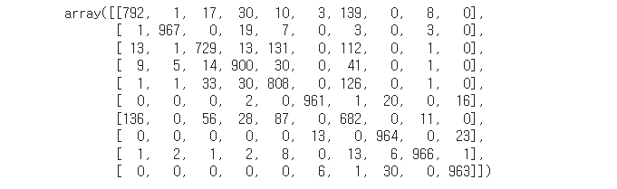

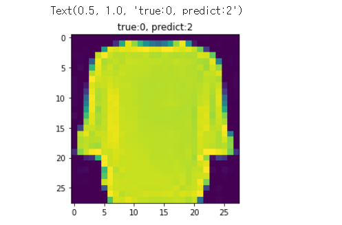

model 에서 layer0 를 따로 떼어서 새로운 model을 생성하고, kernel들을 각각 확인해보기

```python
from tensorflow.keras import models

# 학습된 model의 layer와 output 값을 저장한다.
layer_outputs = [layer.output for layer in model.layers[:1]]

# model.input : 원래 model 의 input layer
# layer_outputs : model.layers 의 학습된 kernel layer
activation_model = models.Model(inputs=model.input, outputs=layer_outputs)

activations = activation_model.predict(x_test[0].reshape(1,28,28))
activations.shape[-1] # 64

features = activations.shape[-1] # activation_model을 통과한 결과의 이미지 갯수
size = activations.shape[1] # 통과한 이미지 결과의 크기 
plt.figure(figsize=(5,5))
for i in range(features):
  plt.subplot(4,activations.shape[-1]/4, i+1)
  plt.subplots_adjust()
  plt.imshow(activations[0,:,:,i])
plt.tight_layout()
```

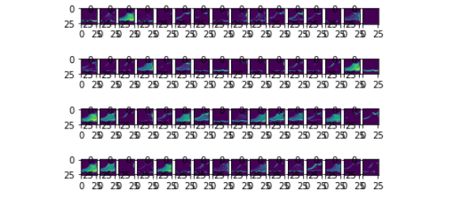


### 4. Tensor Hub 모델 이용하기

tensorhub 를 이용해 이미 학습된 model 을 불러올수 있다. 

이미지 속 물체를 인식하는 faster_rcnn 모델 실습

```python
import tensorflow as tf
import tensorflow_hub as tfhub
import matplotlib.pyplot as plt

model = tfhub.load("https://tfhub.dev/google/faster_rcnn/openimages_v4/inception_resnet_v2/1")

# 모델 용도 확인
# 하나의 모델이라도 signatures에 따라서 다양한 용도가 존재할수 있음. 
# model 사용전에 signatures 지정
model.signatures.keys()

fast_rcnn = model.signatures["default"] # default: 용도 1개임 (object detect)

type(fast_rcnn) # tensorflow.python.eager.wrap_function.WrappedFunction

img_path = "https://imgnews.pstatic.net/image/656/2022/03/31/0000007281_001_20220331095802286.jpg"
img = tf.keras.utils.get_file(origin=img_path)
img = tf.image.decode_jpeg(tf.io.read_file(img), 3)
img = tf.image.convert_image_dtype(img, tf.float32)

plt.imshow(img)

img_resize = tf.expand_dims(img, 0) # 배치추가
img_resize.shape # TensorShape([1, 279, 540, 3])

result = fast_rcnn(img_resize)# 추론과정
result.keys() # 추론 결과 확인 
# dict_keys(['detection_class_labels', 'detection_class_entities', 'detection_scores', 'detection_class_names', 'detection_boxes'])

#결과 표현 
boxes = result["detection_boxes"]
labels = result["detection_class_entities"]
scores = result["detection_scores"]

obj_num = 15

img_height = img.shape[0]
img_width = img.shape[1]

plt.figure(figsize=(15,10))
for i in range(obj_num):
  y_max, x_min = boxes[i][0] * img_height, boxes[i][1] * img_width
  y_min, x_max = boxes[i][2] * img_height, boxes[i][3] * img_width
  plt.imshow(img)
  plt.plot([x_min, x_max,x_max,x_min,x_min],[y_min,y_min, y_max, y_max,y_min], color="yellow")
  name=labels[i].numpy().decode("utf-8")
  score = int(scores[i].numpy()*100)
  name_score = f"{name}: {score}%"
  plt.text(x=x_min, y=y_max, s=name_score, color="white", backgroundcolor="red")
    
labels[0].numpy().decode("utf-8") # Man
```

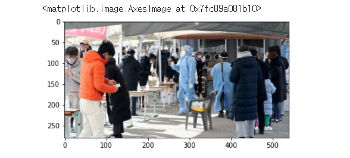

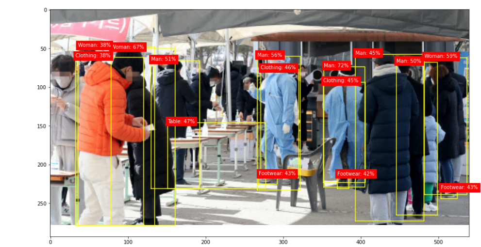
