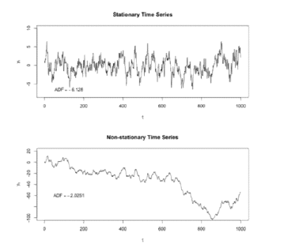
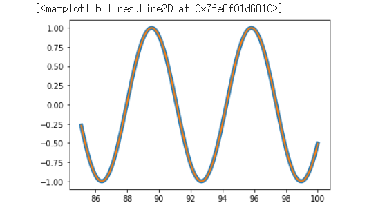

# 220401🍕


## 순환 신경망 (Recurrent Neural Network, RNN)

관련 자료 https://wikidocs.net/22886 


### 1. TimeSeries Data (시계열 데이터)

Full-connected/CNN은 정지된 상태에서 정답을 예측

- (데이터: 정답) 형태를 학습시키고 문제 -> 해결을 통해 정답을 도출하는 과정

정지된 상태가 아닌, 시간에 영향을 받아 흐르고 있는 데이터를 예측하려면?


#### 1) Sequence Data (순차 데이터)

- Sequence Data: 순서가 의미가 있으며, 순서가 달라질 경우 의미가 손상되는 데이터

  - 자연어 문장

  - 심전도

  - 동영상

  - 주가

- Temporal Sequence: 시간적 의미가 있는 경우

- Time Series: 일정한 시간차를 가짐


#### 2) TimeSeries Data의 분류

- Deterministic

  - 어떤 특정한 입력이 들어오면 언제나 똑같은 과정을 거쳐 똑같은 결과를 내보내는 데이터

- Stochastic

  - 과거의 데이터가 미래의 데이터에 영향을 미치지만, 확률적으로 변화하는 데이터

  - Stationary: 시간이 변해도 평균, 분산 변하지 않음 -> 특정 분포를 따라감

  - Non-Stationary: 매 시간마다 평균과 분산이 바뀜 -> 분포를 예측하기가 어려움

    


### 2. 시계열 데이터의 예측

#### 1) Markov Chain


### 3. RNN 실습

```PYTHON
import pandas as pd
import numpy as np
import matplotlib.pyplot as plt

x = np.linspace(0, 100, 1001)
x = np.round(x, 1) # 소숫점 문제가 존재해서 첫째자리를 기준으로 반올림
y = np.sin(x) #wave data 를 학습시켜 보자 
plt.plot(x, y)

# Test data와 train 데이터로 나눠준다.
df = pd.DataFrame(data=y, index=x, columns=["sine_wave"])
train = df.iloc[:801]
test = df.iloc[801:]


# scale data
# 숫자가 너무 커도 학습이 잘안되고, 음수가 가 있어도 학습이 잘안된다. 
from sklearn.preprocessing import MinMaxScaler
scaler = MinMaxScaler()
scaler.fit(train)
s_train = scaler.transform(train)
s_test = scaler.transform(test)

# Time series Generator
# regression 같은 경우는 x 값을 대입하면 y값이 나오게끔 학습시키지만, 
# Sequential 데이터를 예측하는 경우 특정 기간내의 data가 미래 데이터에 영향을 주기 때문에
# timeseriesGenerator 를 사용해 데이터 묶음을 만들어 준다. 
from tensorflow.keras.preprocessing.sequence import TimeseriesGenerator

length = 50 ( 길이가 50인 data)
generator = TimeseriesGenerator(s_train, s_train, length=length, batch_size=1)

generator[0] # (array([[[4.99998429e-01],[5.49915469e-01],[5.99333755e-01],...]]), array([[0.0205331]])) <- generator[0][0]이 타겟 데이터

# model 생성
import tensorflow as tf

model = tf.keras.models.Sequential()
model.add(tf.keras.layers.SimpleRNN(100, input_shape=(50,1)))
model.add(tf.keras.layers.Dense(1))

model.summary()

model.compile(optimizer="adam", loss="mse")
model.fit(generator, epochs=4)

# test dataset 변경
s_g_test = TimeseriesGenerator(s_test, s_test, length=length, batch_size=1)

# test data의 51번째 값 예측
predict_test = model.predict(s_g_test)
true_predict = scaler.inverse_transform(predict_test)

true_predict.shape # (150, 1)
test.shape # (200, 1)
# test data의 앞의 50개의 데이터를 이용해 51번째 데이터를 예측했기 때문에 앞부분 50의 데이터는 사라진다. 
# 예 0,1,2,3,4,~49 -> 50
# 원래 데이터 0~200
# 예측 데이터 50~201

# 실제값과 예측값 비교하기
test2 = test.drop(test.index[0:length]) # 실제값으로 구성된 dataframe 
test2["predict_test_simplernn"] = true_predict #예측값을 dataframe 에 추가

plt.plot(test2.index, test2.sine_wave, linewidth = 5.0)
plt.plot(test2.index, test2.predict_test_simplernn, linewidth = 2.0)
```

ㅇ