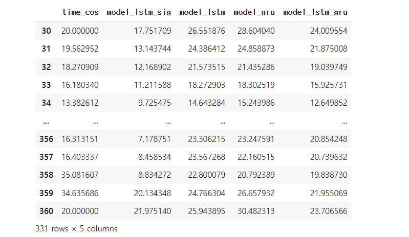
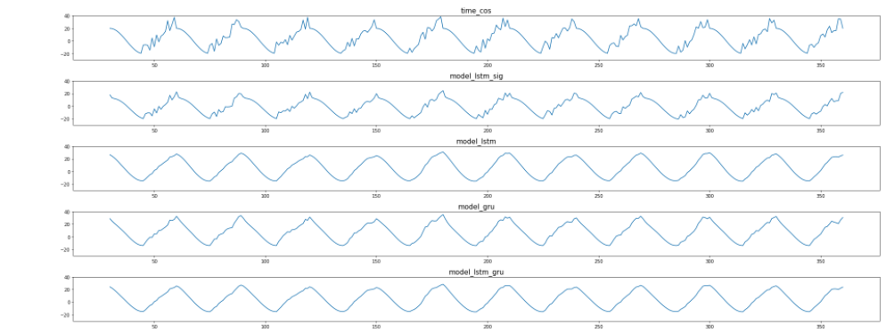
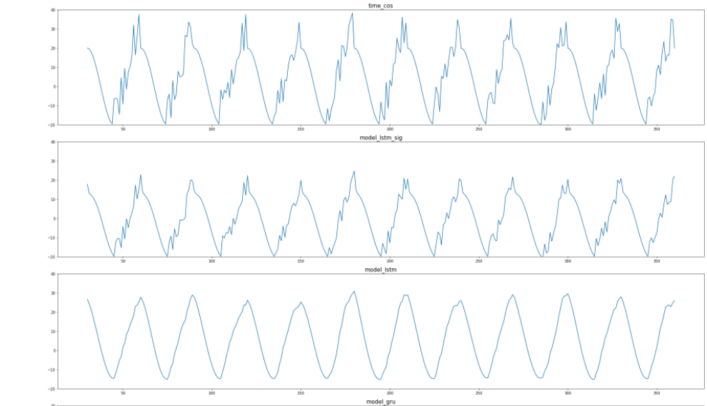
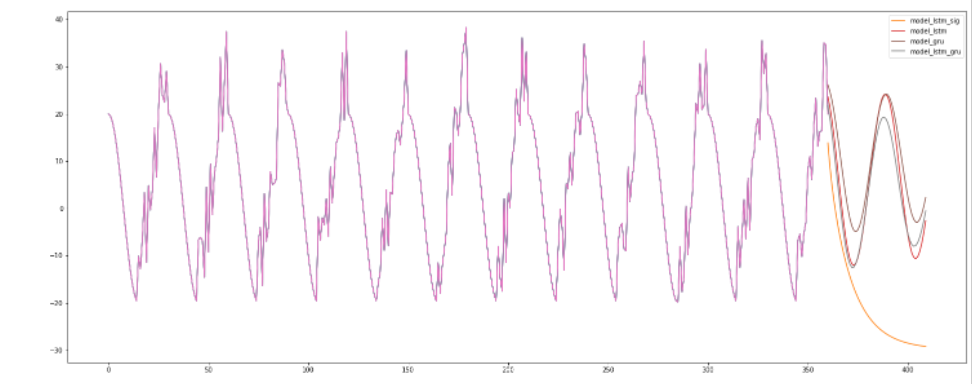
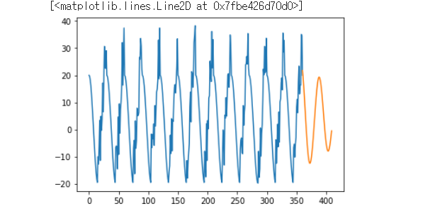

# 220404🍕


## **장단기 메모리(Long Short-Term Memory, LSTM)**


다양한 모델 생성해보기

- model_lstm_sig : activation function 을 sigmoid 로 적용
- model_lstm : activation :tanh
- model_gru : rnn(GRU)
- model_lstm_gru : lstm + gru 2개 레이어로 학습

```python
import pandas as pd
import numpy as np
import matplotlib.pyplot as plt
import tensorflow as tf

# data 생성
np.random.seed(2022)

x = np.arange(30 * 12 + 1)
month_time = (x % 30) / 30
y = 20 * np.where(month_time < 0.5, 
                          np.cos(2 * np.pi * month_time),
                          np.cos(2 * np.pi * month_time) + np.random.random(361))

# data 그래프
plt.figure(figsize = (10, 5)) 
plt.plot(np.arange(0, 30 * 11 + 1), y[:30 * 11 + 1])

# data scaling
# y -> dataframe
df = pd.DataFrame(index = x, data = y, columns=["time_cos"])

# minmax scale
# y 데이터를 train set 으로 만들어 주기 위해 minmax scaler(40 ~ -20 -> 1 ~ -1), time series data (RNN) 로 변경해준다.
# regression : x(독립변수) -> y(종속변수)
# seqdata 예측 : x(x1, x2, x3, x4) -> x (x5) 예측

from sklearn.preprocessing import MinMaxScaler
scaler = MinMaxScaler() # 객체 생성
scaler.fit(df) # 데이터에 맞게 객체 fit
s_train = scaler.transform(df) # 데이터 scaling

# generator 생성
from tensorflow.keras.preprocessing.sequence import TimeseriesGenerator
length = 30
generator = TimeseriesGenerator(s_train, s_train, length=length, batch_size = 1)

# model 생성
# model_lstm_sig : activation function 을 sigmoid 로 적용
model_lstm_sig = tf.keras.models.Sequential(name="model_lstm_sig")
model_lstm_sig.add(tf.keras.layers.LSTM(30, activation="sigmoid", input_shape=(30,1)))
model_lstm_sig.add(tf.keras.layers.Dense(1))

model_lstm_sig.compile(optimizer= "adam", loss ="mse")

# model_lstm : activation :tanh
model_lstm = tf.keras.models.Sequential(name="model_lstm")
model_lstm.add(tf.keras.layers.LSTM(30, input_shape=(30,1)))
model_lstm.add(tf.keras.layers.Dense(1))

model_lstm.compile(optimizer= "adam", loss ="mse")

# model_gru : rnn(GRU)
model_gru = tf.keras.models.Sequential(name="model_gru")
model_gru.add(tf.keras.layers.GRU(30, input_shape=(30,1)))
model_gru.add(tf.keras.layers.Dense(1))

model_gru.compile(optimizer= "adam", loss ="mse")

# model_lstm_gru : lstm + gru 2개 레이어로 학습
model_lstm_gru = tf.keras.models.Sequential(name="model_lstm_gru")
model_lstm_gru.add(tf.keras.layers.LSTM(30, return_sequences=True, input_shape=(30,1))) #return sequence 를 통해 RNN 계열의 layer 끼리 연결 가능
model_lstm_gru.add(tf.keras.layers.GRU(30))
model_lstm_gru.add(tf.keras.layers.Dense(1))

model_lstm_gru.compile(optimizer= "adam", loss ="mse")

# 반복문을 통해서 4개의 model 을 generator에 대해 학습시킨다. 
model_list = [model_lstm_sig, model_lstm, model_gru, model_lstm_gru]
for i in model_list:
  i.fit(generator, epochs = 4)
# 예측 과정: 0~29 -> 30 예측, 1~30 -> 31 예측, 2~31 -> 32 예측


```

predict 후 시각화

```python
# 반복문을 통해서 predict
df_2 = df.drop(df.index[:length])
for i in model_list:
  tmp = i.predict(generator)
  tmp_2 = scaler.inverse_transform(tmp)
  df_2[i.name] = tmp_2
  print(i.name)

df_2
```



```python
# 모델 별 predict 그래프
# 그래프 1
plt.figure(figsize=(25,10))
n=1
for i in df_2.columns:
  ax = plt.subplot(len(df_2.columns), 1, n) # 1개의 열, df_2 컬럼의 갯수만큼 행, n : 어디에 위치 하는지 
  plt.title(f"{i}", fontsize = 15)
  plt.ylim(-30,40)# y 값 고정
  ax.plot(df_2.index, df_2[i], label= str(i)) # x축은 df_2.index, y 축값은 예측한값
  n += 1
plt.tight_layout()

# 그래프 2
ax = plt.subplot(1, 1, 1)
plt.title("time_cos", fontsize = 15)
ax.plot(df_2.index, df_2["time_cos"], label= "time_cos")

plt.figure(figsize=(25,25))
n=1
for i in df_2.columns:
  ax = plt.subplot(len(df_2.columns), 1, n) # 1개의 열, df_2 컬럼의 갯수만큼 행, n : 어디에 위치 하는지 
  plt.title(f"{i}", fontsize = 15)
  plt.ylim(-20,40)# y 값 고정
  ax.plot(df_2.index, df_2[i], label= str(i)) # x축은 df_2.index, y 축값은 예측한값
  n += 1
plt.tight_layout()

```





forecast 그래프

```python
plt.figure(figsize=(25,10))
for j in model_list:
  forecast = [] #예측값 저장
  batch = s_train[-30:]
  current_batch = batch.reshape((1,30,1))
  forecast_index = np.arange(360,410, step = 1)
  for i in range(50): #360에서 410 까지 예측
    current_pred = j.predict(current_batch)[0]
    forecast.append(current_pred)
    # 원래 데이터 331~360 에서 331 제거, 뒤에 361 추가 
    current_batch = np.append(current_batch[:,1:,:], [[current_pred]], axis = 1)
  forecast = scaler.inverse_transform(forecast)

  plt.plot(df.index, df["time_cos"])
  plt.plot(forecast_index, forecast, label = f"{j.name}")
  plt.legend(loc="upper right")
```



model_lstm_gru로 forecast

```python
# 예측
# 331~360(batch)  -> 361 (forecast 에 저장)
# 332~361  -> 362
# 333~362  -> 363

forecast = [] #예측값 저장
batch = s_train[-30:]
current_batch = batch.reshape((1,30,1))
forecast_index = np.arange(360,410, step = 1)
for i in range(50): #360에서 410 까지 예측
  current_pred = model_lstm_gru.predict(current_batch)[0]
  forecast.append(current_pred)
  # 원래 데이터 331~360 에서 331 제거, 뒤에 361 추가 
  current_batch = np.append(current_batch[:,1:,:], [[current_pred]], axis = 1)
forecast = scaler.inverse_transform(forecast)

plt.plot(df.index, df["time_cos"])
plt.plot(forecast_index, forecast)

current_pred = model_lstm_gru.predict(current_batch)[0]
current_batch = np.append(current_batch[:,1:,:], [[current_pred]], axis = 1)
current_batch
```




---

- ONNX (Open Neural Network Exchange)