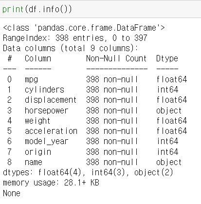
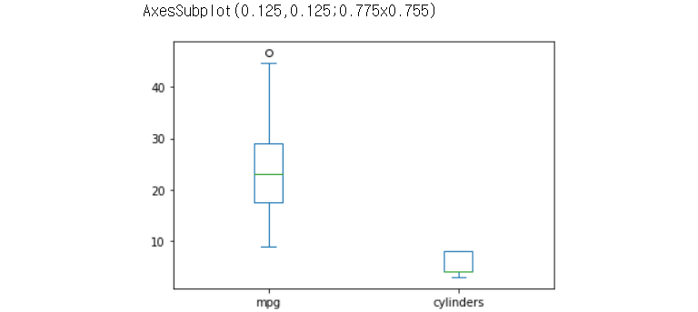

# 15일차 🍕


## 데이터프레임의 구조
- auto-mpg.csv 데이터셋 사용
- mpg(연비), cylindes(실린더 수), displacement(배기량), horsepower(출력), weight(차종), acceleration(가속능력), model_year(출시년도), origin(제조국), model_name(모델명)순으로 나열


### 1. 데이터프레임의 내용 확인

- 앞부분 미리보기: `DataFrame객체.head(n)`
- 뒷부분 미리보기: `DataFrame객체.tail(n)`

```python
import pandas as pd

# read_csv() 함수로 df 생성
df = pd.read_csv('./auto-mpg.csv', header = None)

# 열 이름 지정
df.columns = ['mpg', 'cylinders', 'displacement', 'horsepower', 'weight',
            'acceleration', 'model_year', 'origin', 'name']

# head, tail 확인
print(df.head())
print(df.tail())
```


### 2. 데이터의 요약 정보 확인하기

#### 1) 데이터프레임의 크기 확인
- `DataFrame객체.shape`
- 행과 열의 개수를 튜플 형태로 출력 (행의 개수, 열의 개수)

```python
print(df.shape)
```


#### 2) 데이터의 기본 정보 확인하기
- `DataFrame객체.info()`
- 데이터프레임에 관한 기본 정보를 출력
- 클래스 유형, 행 인덱스 구성, 열 이름의 종류와 개수, 각 열의 자료형과 개수, 메모리 할당량에 관한 정보 포함

```python
print(df.info())
```



- 판다스 자료형
    - int64: 정수형 데이터
    - float64: 실수형 데이터
    - object: 문자열 데이터
    - datetime64, timedelta64: 시간 데이터
- dtypes 속성에는 각 열에 대한 자료형의 개수가 포함

```python
# dtypes 속성 활용하여 각 열의 자료형 확인
print(df.dtypes)

# 데이터프레임의 특정 열(mpg)의 자료형 확인
print(df.mpg.dtypes)
```


#### 3) 데이터프레임의 기술 통계 정보 요약
- `Dataframe객체.describe()`
- 산술(숫자) 데이터를 갖는 열에 대한 주요 기술 통계 정보(평균, 표준편차, 최대값, 중간값 등)을 요약하여 출력

```python
# df의 기술통계 정보 확인
print(df.describe())

# include옵션 사용하여 고유값 개수(unique), 최빈값(top), 빈도수(freq)까지 추가로 확인
print(df.describe(include = 'all'))
```


### 3. 통계 함수 적용

#### 1) 평균값

- `DataFrame객체. mean()`
- 산술 데이터를 갖는 모든 열의 평균값을 계산하여 시리즈 객체로 변환
- 특정 열의 평균값 확인: DataFrame객체['열 이름'].mean()

```python
# 전체 열의 평균값 계산
print(df.mean())

# 특정 열의 평균값 계산
print(df['mpg'].mean())

# 특정 열 두개 평균값
print(df[['mpg', 'weight']].mean())
```


#### 2) 중간값

- `DataFrame객체.median()`
- 산술 데이터를 갖는 모든 열의 중간값 계산하여 시리즈로 반환

```python
# 전체 열의 중간값
print(df.median())

#특정 열의 중간값
print(df['mpg'].median())
```


#### 3) 최댓값

- `DataFrame객체.max()`

```python
# 전체 열의 최댓값
print(df.max())

# 특정 열의 최댓값
print(df['mpg'].max())
```

- 문자열은 ASCII 숫자로 변환하여 크고 작음을 비교
- 'horsepower'열에는 "?"문자가 포함되어 있기 때문에 최댓값도 "?" 출력


#### 4) 최솟값

- `DataFrame객체.min()`

```python
# 전체 열의 최솟값
print(df.min())

# 특정 열의 최솟값
print(df['mpg'].min())
```


#### 5) 표준편차

- `DataFrame.std()`
- 편차: 기본 데이터가 평균으로부터 얼마나 떨어져 있는지를 알 수 있는 척도

```python
# 전체 열의 표준편차
print(df.std())

# 특정 열의 표준편차
print(df['mpg'].std())
```

####  

#### 6) 상관계수

- `DataFrame.corr()`
- 산술 데이터를 갖는 모든 열에 대해 2개씩 서로 짝을 짓고, 각각의 경우에 대한 상관계수를 계산
- 특정 열의 상관계수: DataFrame객체[열 이름 리스트].corr()

```python
# 전체 열의 상관계수
print(df.corr())

# 특정 열의 상관계수
print(df[['mpg', 'weight']].corr())
```


- 상관계수 절대값의 크기는 직선관계와 가까운 정도를 표현, 부호는 직선관계의 방향을 나타냄
  - r > 0 : 양의 상관관계, 산점도에서 점들이 우상향방향으로 띠를 형성(기울기 양수)
  - r < 0 : 음의 상관관계, 산점도에서 점들이 우하향방향으로 띠를 형성(기울기 음수)
  - r = +1 : 모든 점이 정확히 기울기가 양수인 직선 위에 위치
  - r = -1 : 모든 점이 정확히 기울기가 음수인 직선 위에 위치


## 판다스 내장 그래프 도구 활용

### 1. 선 그래프

- `DataFrame객체.plot()`
- 남북한발전전력량.xlsx 데이터 활용
  - 시간의 흐름에 따른 연도별 발전량 변화 추이를 보기 위해 연도 값을 x축에 표시하는 것이 적절
  - 연도 값이 행 인덱스에 위치하도록 행렬을 전치하여 데이터프레임 제작

```python
import pandas as pd

df = pd.read_excel('./남북한발전전력량.xlsx')

# 남북한 발전량 합계 데이터 추출
df_ns = df.iloc[[0,5], 2:]

# 행 인덱스 변경
df_ns.index = ['South', 'North']

# 열 이름의 자료형을 정수형으로 변경
df_ns.columns = df_ns.columns.map(int)

# 추출 데이터 확인
print(df_ns)

# 행렬 전치
tdf_ns = df_ns.T

# head 데이터 확인
print(tdf_ns.head())

# 선 그래프 그리기
print(tdf_ns.plot())
```


### 2. 막대 그래프

- `DataFrame객체.plot(kind = 'bar')`

```python
print(tdf_ns.plot(kind = 'bar'))
```


### 3. 히스토그램

- `DataFrame객체.plot(kind = 'hist')`
- 빈도와 관련

```python
print(tdf_ns.plot(kind = 'hist'))
```


### 4. 산점도

- `df.plot(x, y, kind = 'scatter')`
- ''자동차 연비 데이터셋'' 이용하여 두 변수의 관계를 나타내는 산점도 제작
- 코드 항목

 	1. plot()함수에 kind = 'scatter' 옵션 추가
 	2. 데이터프레임 열 중에서 서로 비교할 두 변수 선택
 	 - x축에 차량 무게 'weight'열을 지정
 	 - y축에 연비 'mpg'열을 지정

```python
import pandas as pd

# read_csv() 함수로 df 생성
df = pd.read_csv('./auto-mpg.csv', header = None)

# 열 이름 지정
df.columns = ['mpg', 'cylinders', 'displacement', 'horsepower', 'weight',
            'acceleration', 'model_year', 'origin', 'name']

# 두 개의 열을 선택하여 산점도 그리기
print(df.plot(x = 'weight', y = 'mpg', kind = 'scatter'))
```


### 5. 박스 플롯

- `DataFrame객체.plot(kind = 'box')`
- 특정 변수의 데이터 분포와 분산 정도에 대한 정보를 제공
  - 변수들의 데이터가 퍼져 있는 정도를 확인할 때 사용

```python
# 열을 선택하여 박스 플롯 그리기
print(df[['mpg', 'cylinders']].plot(kind = 'box'))
```



- 그래프 해석
  - 맨 위의 원: 수치에서 벗어난 값
  - 박스 플롯 최상단: 최댓값 max
  - 박스 윗부분: 분위수 75%
  - 박스 가운데 부분: 중간값 50%
  - 박스 아랫 부분: 분위수 25%
  - 박스 플롯 최하단: 최솟값 min 

- 'cylinders'의 박스 플롯
  - 최댓값 = 분위수 75%
  - 중간값 = 분위수 25%


## Matplotlib

- 2D 평면 그래프에 관한 다양한 포맷과 기능 지원

- 그래프 요소를 세세하게 꾸미기 가능

- 제목 지정

  - 차트 제목 추가: `plt.title('차트 제목')`

  - 축 제목 추가: `plt.xlabel('x축 제목')`, `plt.ylabel('y축 제목')`
  - 옵션: `size = 10` -> 폰트 크기를 10으로 설정

- 범례 추가

  - `plt.legend(labels=['이름'])`
  - 옵션: loc, fontsize

- 한글 폰트 문제 해결

  - 파이썬 프로그램의 앞부분에 한글 폰트를 지정하는 코드 추가

- x축 눈금 라벨의 글씨가 서로 겹쳐 잘 보이지 않는 문제를 해결

  - 눈금 라벨이 들어갈 만한 충분한 여유 공간이 없기 때문에 발생하는 문제
  - 해결 방법 2가지
    - 공간을 만들기 위해 `figure()`함수 사용하여 가로 사이즈를 더 크게 설정
    - `xticks()` 함수 사용하여 x축 눈금 라벨을 반시계 방향으로 90도 회전

- 스타일 서식 지정

  - 색, 스타일 등 디자인적 요소를 사전에 지정된 스타일로 빠르게 변경 가능

  - matplotlib 실행 환경 설정을 변경하는 것이므로 다른 코드를 실행할 때도 계속 적용됨

  - 예제에서는 'ggplot'이라는 스타일 서식 지정: `plt.style.use('ggplot')`

  - plot() 함수에 `marker = 'o' `옵션을 추가하여 원 모양의 점을 마커로 표시
  - 종류: default, classic, bmh, dark_background, fast, grayscale, seaborn 등


### 1. 선 그래프

- 연속하는 데이터 값들을 직선 또는 곡선으로 연결하여 데이터 값 사이의 관계를 표현
- 시계열 데이터와 같이 연속적인 값의 변화와 패턴을 파악하는 데 적합
- `plt.plot(x, y)`

```python
import pandas as pd

# 데이터 시각화에 사용할 matplotlib.pyplot 모듈을 import
import matplotlib.pyplot as plt

# matplotlib 한글 폰트 오류 문제 해결
from matplotlib import font_manager, rc
## font_manager는 경로와 이름을 가지고 폰트를 지정
font_path = "./malgun.ttf"
font_name = font_manager.FontProperties(fname=font_path).get_name()
## rc는 폰트를 적용
rc('font', family=font_name)

# Excel 데이터를 데이터프레임 변환 (첫 열을 헤더로 사용)
df = pd.read_excel("./시도별 전출입 인구수.xlsx", header = 0)

# 누락값(NaN)을 앞 데이터로 채움(엑셀 양식 병합)
df = df.fillna(method='ffill')

# 서울에서 다른 지역으로 이동한 데이터만 추출
mask = (df['전출지별'] == '서울특별시') & (df['전입지별'] != '서울특별시')
df_seoul = df[mask]

# '전출지별' 열은 필요 없으므로 삭제
df_seoul = df_seoul.drop(['전출지별'], axis=1)

# '전입지별' 열은 '전입지'로 이름 변경 후 행인덱스로 설정
df_seoul.rename({'전입지별': '전입지'}, axis=1, inplace=True)
df_seoul.set_index('전입지', inplace=True)

# 서울에서 경기도로 이동한 인구 데이터 값만 선택
dt_g = df_seoul.loc['경기도']

# 스타일 서식 지정
plt.style.use('ggplot')

# 그림 사이즈 지정(가로 14인치, 세로 5인치)
plt.figure(figsize = (14,5))

# x축 눈금 라벨 회전
plt.xticks(rotation = 'vertical')

# 1) x, y축 데이터를 plot()함수에 직접 입력 (마커 표시 추가)
plt.plot(dt_g.index, dt_g.values, marker = 'o', markersize = 10) 

# 2) 판다스 객체를 plot()함수에 입력
# plt.plot(dt_g)

# 차트 제목 추가
plt.title('서울 -> 경기 인구 이동', size = 30)

# 축 이름 추가
plt.xlabel('기간', size = 20)
plt.ylabel('인구 이동 수', size = 20)

# 범례 추가
plt.legend(labels=['서울 -> 경기'], loc='best', fontsize=15)

# 차트 시각화
plt.show
```

- 17행 추가 설명) 

  - '전출지별' 열에는 누락 데이터(NaN) 다수 존재
  - Excel 파일에서 병합된 셀을 데이터프레임으로 변환할 때 적절한 값을 찾지 못해 발생

  - method = 'ffill'옵션을 사용하여 누락 데이터가 있는 행의 바로 앞에 위치한 데이터 값으로 채움

- 38행 추가 설명)

  - 글씨를 회전하기 위해 사용한 rotation = 'vertical' 대신 각도를 나타내는 숫자로 표현할 수 있음. 
  - ex) rotation = 90 -> 반시계 방향으로 90도 회전 

